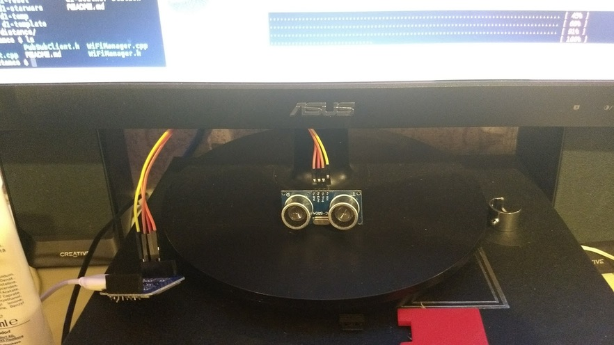

# Ultrasonic Distance Reporting

This project uses an HR-SR04 sensor to report upon distance.

In this case the sensor is mounted below my monitor, with the intention
that it can decide if somebody is present or not based upon measuring the
distance to the nearest object.

If I'm sat in front of the desk I will be measured at 70-90cm away,
if not the reading will refer to the wall behind me ~2m away.

The distance information will be published to a MQQ / Mosquitto server on the
topic `distance`.  Additionally the board will dump all its meta-info
to the topic `meta` on startup.

The meta-information includes:

* Hostname
* IP Address
* MAC Address
* etc.

## Configuration

You'll need to change the IP address of the MQQ server if you wish
to deploy this yourself.

## Wiring

The sensor is wired to pins D2, and D3, which you can see documented
in the script itself.

# Extras

There is a simple Perl script included in `Handler/` which will receive
messages and trigger a "present" and "away" function, based upon the
reported-distance.  See the script for details.
