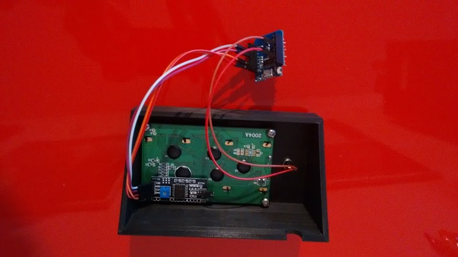
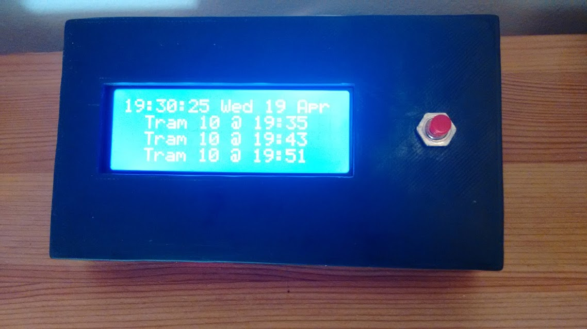
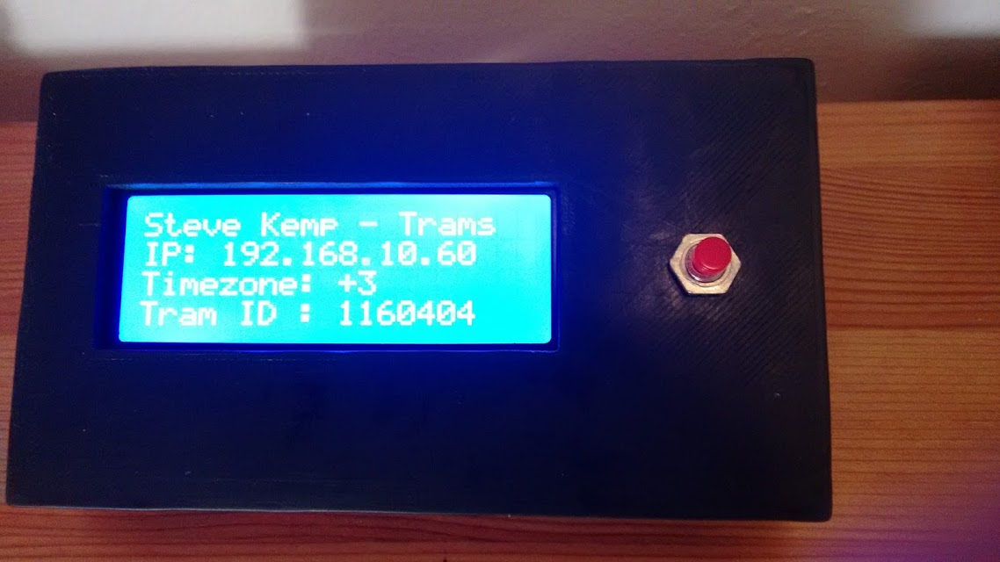

# Helsinki Tram Times

This project combines an ESP8266 processor with a LCD display, such that
it shows the next departures from a given Helsinki tram-stop.

The code is self-contained, and described on this project homepage:

* https://steve.fi/Hardware/helsinki-tram-times/

# Images

These images show the final result:

This is the first time I've had anything 3d-printed, but the process was pretty simple, because somebody else designed the case and I could download that design for free!

* http://blog.steve.fi/3d_printing_is_cool.html

# Configuration

Once compiled and uploaded the project will attempt to connect to your
local WiFi network.  If no access details have been stored previously
it will instead function as an access-point named `TRAM-TIMES`.

Connect to this access-point with your mobile, or other device, and
you can select which network it should auto-join in the future.

> (This "connect or configure" behaviour is implemented by the excellent [WiFiManager](https://github.com/tzapu/WiFiManager) class.)

The only addition configuration required is to set the tram-stop to
view - by default it will show the departures of [Kytösuontie](https://hsl.trapeze.fi/omatpysakit/web?command=fullscreen2&stop=1160404).   To change
the tram-stop open the IP address in your browser and use the HTML-form
to submit the new ID.

## Remote API

The script by default parses, and displays, a simple CSV file which is
hosted remotely.  By default that is:

     https://steve.fi/Helsinki/Tram-API/api.cgi?id=__ID__

You can use your browser to replace that end-point with one of your
own choosing - which means that you can host it yourself, and write
your own tram-data there.

This will allow you to use this project with zero changes to the code!

# Optional Button

If you wire a button between D0 & D8 you gain additional functionality:

* Short-Press the button to toggle the backlight.
* Double-click to show information.
* Long-Press the button to resync the date/time __and__ the tram-data.

The info-page looks like this:

